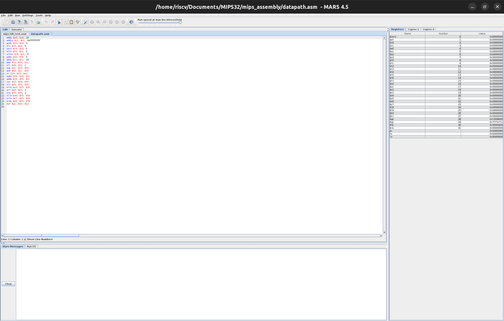

<h1 align="center"> VLSI 101 MIPS32-Core: An Open-Source Processor </h1>

<h3 align="center"> Welcome to a guided, week-by-week process to make your own processor! 🦾 </h3>

<div align="center"></div><br>


This project guides you in creating a **M**icroprocessor without **I**nterlocked **P**ipelined **S**tages (MIPS), which is based on the **R**educed **I**nstruction **S**et **C**omputer (RISC) philosophy.

For essential reading, please check the resources file for the book: *Computer Organization and Design: The Hardware Software Interface by Patterson and Hennessy*.

---

## 🛠️ Our Open-Source Toolchain

We will use the following open-source tools to realize our processor. You won't need huge, expensive EDA tools to get started on the basic RTL flow.

| **Logo** | **Tool** | **Role in Project** |
| :--: | :--- | :--- |
| <a href="https://github.com/steveicarus/iverilog"></a> | **Icarus Verilog** | Our trusty Verilog simulator for running initial tests and debugging our RTL code. |
| <a href="https://github.com/gtkwave/gtkwave"></a> | **GTKWave** | The go-to wave viewer to visualize simulation outputs and dive deep into the processor's signals. |
| <a href="https://github.com/cocotb/cocotb"></a> | **Cocotb** | For powerful, Python-based verification. This lets us write complex testbenches to hunt down tricky bugs. |
| <a href="https://github.com/YosysHQ/yosys"></a> | **Yosys** | The synthesis powerhouse. Yosys transforms our human-readable Verilog into a netlist of logic gates. |
| <a href="https://github.com/google/skywater-pdk"></a> | **Skywater 130nm PDK** | Google's open Process Design Kit. This is the "recipe book" for creating a real, physical chip layout. |


---

## 🎓 Introductory Sessions

Here are our introductory sessions, held in collaboration with Tech Club SSN during the previous academic year:

<details>
<summary><b>Session 01: Getting Started</b></summary>
<br>

* New to the world of VLSI?
* New to Computer Architecture and Organization?
* Want to know what a processor is?

**Watch this: [1. Getting Started with MIPS](https://youtu.be/AupIYlntl3M?si=rqSnJue8oC1PJcy8)**

</details>

<details>
<summary><b>Session 02: The Instruction Set</b></summary>
<br>

* What is an Instruction?
* What is an Instruction Set?
* What is an Instruction Set Architecture (ISA)?

**Watch this: [2. Moving on with Instruction Set](https://www.youtube.com/watch?v=z86tduEf4AY)**

</details>

---

<details>
<summary><b> 🗓️ Week 01</b></summary>

## Diving Into MIPS Assembly

Before designing a processor, learning its assembly language provides great clarity for the design process later on.

### Tasks For This Week:

1.  **Explore available MIPS simulators online.** Here are a few to get you started:
    * [MIPS Assembler - CS Field Guide](https://www.csfieldguide.org.nz/en/interactives/mips-assembler/)
    * [MIPS Simulator - CS Field Guide](https://www.csfieldguide.org.nz/en/interactives/mips-simulator/)
    * [NTU MIPS 101](https://www3.ntu.edu.sg/home/smitha/fyp_gerald/rDatapath.html)
    * *Please do not hesitate to explore more!*

2.  **Install [MARS](https://dpetersanderson.github.io/index.html)**, a lightweight IDE for programming in MIPS assembly, in line with Patterson and Hennessy's book.

3.  **Ensure you have the latest Java version running** (OpenJDK version 21.0.8 works fine for us).

4.  **Write the following MIPS assembly programs** by referring to the Patterson book (using the base instruction set):
    * Program to compute permutation.
    * Program to compute Greatest Common Factor (GCF).

5.  **Share your doubts and results** in our [MOSphere WhatsApp Group](https://chat.whatsapp.com/Clk8CyQMsujF3XALakg2Ik). Please include your name and a link to your GitHub repo when sharing results.

---

### Working With MARS IDE:

1.  **Start up window** you shall find yourself in

| Linux terminal or WSL | Start up window |
|:---------------:|:---------------:
|  |  |
| *Run this command to run your java executable* | *Startup page you'll come across* |

2.  **Create a new file or open an asm file** check the options under file to choose it accordingly

| File options |
|:---------------:|
|  |
| *File options you'll come across* |

3. **Here's a demo program** you can use

> Sum of first 100 natural numbers

```asm
    addi $a0, $a0, 100           // Initiating register $a0 to 100
    add $t0, $zero, $zero        // Initiating register $t0 to 0 for accumulating the sum
    LOOP: add $t0, $t0, $a0      // Looping and accumulating while decrementing $a0 by 1 until $a0 becomes 0
    addi $a0, $a0, -1
    bne $a0, $zero, LOOP
```

| Demo program |
|:---------------:|
|  |
| *Here's a demo program we used originally to test the datapath of R and I-type instructions* |

4. **Killer visualization** with MIPS X-Ray tool option
<br> <br> ***What is MIPS X-Ray you ask?***
 It's an interactive UI-element where you can visualize the datapath signal flow, disassembled code as well as binary codes for us to visualize and understand. You can run instruction by  instruction using the UI and observe the change in register and memory content.

| Tools option |
|:---------------:|
|  |
| *Under the tools option select the MIPS X-Ray option* |

5. **MIPS X-Ray** UI will open up with the following dialog box, click on the top left icon to assemble the mips assembly code once you load or create an assembly file

| MIPS X-Ray |
|:---------------:|
|  |
| *MIPS X-Ray gives you an interactive UI as follows* |

6. **Run the assembly code** instruction by instruction by clicking the icon next to the assemble icon, every click with execute one instruction

| Running assemble code |
|:---------------:|
|  |
| *Click the green play button on the left top for executing your program instruction by instruction* |

7. **Register File and Control Unit** can be lively viewed to observe the signal flow by clicking on them in the UI element accordingly

| Register file | Control unit |
|:---------------:|:---------------:
|  |  |
| *Register file dialog box showing signal flow* | *Control unit dialog box showing signal flow* |

8. **Check For Solutions:** [Week 01](https://youtu.be/ZpVqjjkXr40)
<br> Got a better solution to share? Check our mips_assembly directory for existing solution, pull a PR and challenge our solution

</details>

---

<details>
<summary><b> 🗓️ Week 02</b></summary>

## Getting Started With The Datapath: R-Type

Hope y'all had fun exploring the Assembly Language for the MIPS architecture. Now it is time for us to start with th processor design.

Now, this week's task focuses on building the **hardware design** that can execute these instructions — starting with **R-type instructions**.


<div align="center"><br><strong><em> * cough, cough based on true events :'')</em></strong></div>

### Tasks For This Week:

1. **Install Icarus Verilog**, Icarus Verilog is a popular open-source to compile HDLs like verilog, you can either get the latest version from their [official documentation](https://steveicarus.github.io/iverilog/usage/installation.html) or get a pre-packaged binary distribution like the one maintained by ubuntu, mentioned in this [medium blog](https://emkboruett.medium.com/installing-icarus-verilog-and-gtkwave-on-ubuntu-for-verilog-simulation-d6d31eee2096)

2. **Install GTKWave**, GTKWave is an open-source tool to visualize analog and digital signals, you can either refer to their [official documentation](https://gtkwave.github.io/gtkwave/) or install and set it up based on the [medium blog](https://emkboruett.medium.com/installing-icarus-verilog-and-gtkwave-on-ubuntu-for-verilog-simulation-d6d31eee2096) again

3. **Simple Implementation** of the MIPS processor, refer to **pgs. 251 to 258** from **Computer Organization book by Patterson and Hennessy** present in resources, start by building the verilog design files for all the base components for R-Type instruction execution. Read through **pgs. 118, 119, 120 and 121** to understand instruction types 

4. **Individually test** each of the components by writing a testbench and looking out for all possible testcases

5. **Create** a `result-<design>.txt` for all the designs of components where the text file consists of all the logs printed by the testbench using **$monitor** or save the waveform file using the gtkwave as a pdf for each design
   
6. **Check For Solutions:** [Week 02](https://youtu.be/G76seRPtboA)
<br> Got a better solution to share? Check our mips_assembly directory for existing solution, pull a PR and challenge our solution
---

### MIPS Core Elements:

To execute instructions, a MIPS processor uses a combination of key datapath components:

1. **Program Counter (PC)**  
- Holds the address of the current instruction.  
- Increments by 4 to move to the next instruction.

2. **Instruction Memory**  
- Stores the program instructions.  
- Fetches instruction using the address in the PC.

3. **Register File**  
- 32 registers, each 32 bits wide.  
- Provides 2 read ports and 1 write port for operand access.  
- Registers are identified by numbers from 0 to 31.

4. **ALU (Arithmetic Logic Unit)**  
- Performs all arithmetic and logical operations (e.g., `add`, `sub`, `and`).  
- Inputs: Two operands and a control signal.  
- Outputs: Result and a `Zero` flag (used in branching).

5. **ALU Control Unit**  
- Converts function code and ALUOp to a specific ALU control signal.  
- Ensures the ALU performs the correct operation for each instruction.

6. **Main Control Unit**  
- Takes opcode as input and generates control signals for the datapath.  
- Determines how data flows through the processor based on instruction type.

7. **Data Memory**  
- Used for `lw`, `sw`, etc.  

8. **Top Module (Datapath Integration)**  
- Connects all components to form the MIPS datapath.  
- Simulates instruction execution by coordinating control and data flow.

</details>

---

<details>
<summary><b> 🗓️ Week 03</b></summary>

## Moving On With The Datapath: R-Type

Hope y'all are doing good till now, we are to get started with desiging our R-Type datapath this week, lessgoo!

<div align="center"><br><strong><em> based on live events</em></strong></div>

### Tasks For This Week:

1. **Understanding Machine Language Decoding** for R-Type instructions. Refer pgs. 118, 119, 120 from the Comp Org book for this exercise following this.

2. **Deccode the following** MIPS Assembly instructions into it's machine code:

```asm
add $t1, $t2, $t3
and $t1, $t4, $t5
slt $s1, $s2, $t0
sra $s1, $s2, 4
jr $t0
jalr $t0
```

3. **Upload** a text or a pdf file with the decoded machine code for the above according to MIPS R-Type instruction.

4. **Read** through the simple impementation given in the Comp Arch book pgs. 251 - 258 to understand the datapath, relate it with the machine decoding path, where your brain acted as the datapath and the control unit.

5. **Write a testbench** to test is for all R-Type instructions of the simple implementation, and upload a `result-top-module-rtype.txt` with your simulation results.

</details>

---

## 🙏 Acknowledgements & Learning Resources

* [Digital Circuits - CircuitVerse](https://learn.circuitverse.org/docs/binary-algebra/)
* [All About Circuits](https://www.allaboutcircuits.com/)
* [Chipverify Verilog Tutorials](https://www.chipverify.com/verilog/verilog-tutorial)
* [Verilog Practice - HDLBits](https://hdlbits.01xz.net/wiki/Main_Page)
* [MARS IDE Documentation](https://dpetersanderson.github.io/index.html)

---

